# Data Cleaning and EDA Project

## Descripción
Este proyecto incluye la limpieza y el análisis exploratorio de datos (EDA) de un dataset que ha elaborado ChatGPT. Se realizó la limpieza del dataset para prepararlo para identificar patrones y relaciones en los datos.

## Objetivos
- Limpiar datos y manejar valores faltantes y anómalos.
- Realizar un análisis exploratorio para identificar patrones.
- Crear visualizaciones para comunicar hallazgos clave.

## Descripción del Dataset

id: Identificador único del registro.

name: Nombre de la persona.

age: Edad de la persona.

income: Ingreso de la persona.

city: Ciudad de residencia.

has_children: Indicador de si tiene hijos.

num_purchases: Número de compras realizadas.

signup_date: Fecha de registro.

## Cómo Ejecutar el Proyecto
1. Clona el repositorio:
   ```bash
   git clone https://github.com/gescuderh/data-cleaning-and-eda-project.git

2. Navega al directorio del proyecto:
   ```bash
   cd data-cleaning-and-eda-project

4. Instala las dependencias:

   Crea un archivo `requirements.txt` para listar las dependencias del proyecto:

   ```text
   jupyter
   numpy
   pandas 
   os
   seaborn
   matplotlib.pyplot
   missingno
   warnings
   ````
   
   ```bash
   pip install -r requirements.txt
   ```

6. Ejecuta el notebook:
   ```bash
   jupyter notebook notebooks/data_cleaning_and_eda.ipynb
   ```

## Limpieza de los datos

Se han identificado las siguientes irregularidades en el dataset original (messy-dataset.csv)

1. Registros Null en las columnas "age" y "num_purchases" y datatype erroneo.
2. Valores atípicos ("-99999") en columna "income".
3. Valores inconsistentes ("Unknown") en columna "city".
4. Valores inconsistentes ("MAYBE") en columna "has_children".

## Análisis Exploratorio de Datos (EDA)

A continuación se muestran los gráficos generados durante el análisis, junto con una breve descripción de cada uno.

### 1. Distribución de la Edad

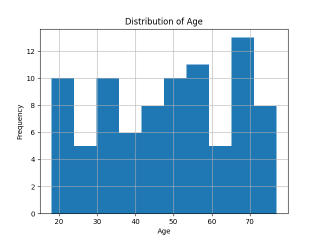

**Descripción**: Este gráfico muestra la distribución de las edades en el dataset. Podemos observar que la mayoría de los registros se encuentran en el rango de 30 a 50 años.

### 2. Distribución de Ingresos

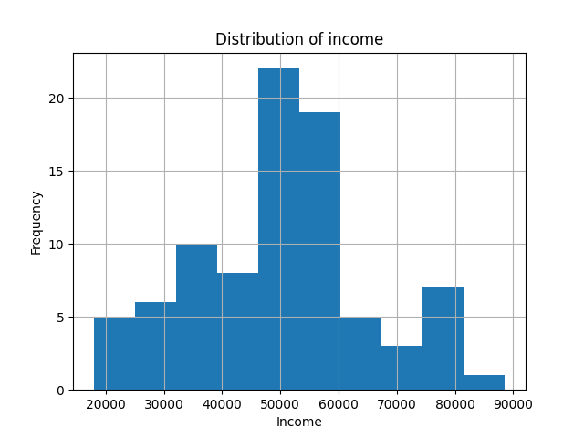

**Descripción**: Este gráfico muestra la distribución de los ingresos en el dataset. La distribución parece ser sesgada hacia los ingresos más bajos.

### 3. Distribución del Número de Compras

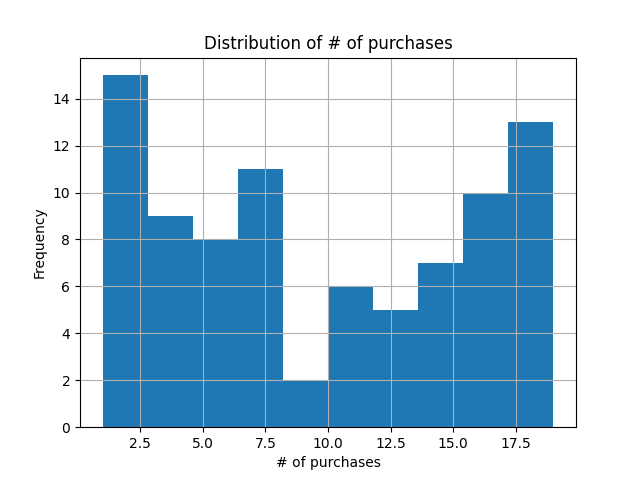

**Descripción**: El gráfico presenta la distribución del número de compras realizadas. La mayoría de los usuarios realizan un número bajo de compras.

### 4. Boxplot de Ingresos

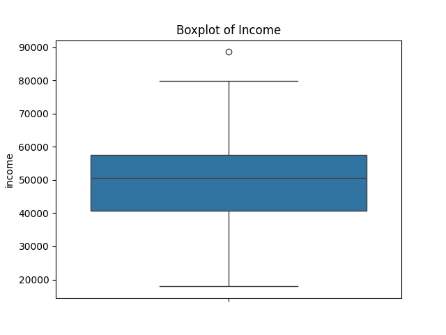

**Descripción**: Este boxplot muestra la variabilidad de los ingresos en el dataset, destacando los valores atípicos y la dispersión de los datos.

### 5. Boxplot de Ingresos por Número de Hijos

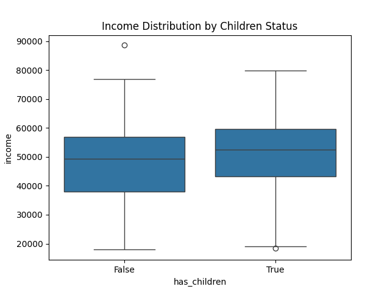

**Descripción**: El boxplot muestra cómo varían los ingresos en función del número de hijos que tiene cada usuario. Se observa una diferencia notable entre los grupos.

### 6. Boxplot del Número de Compras

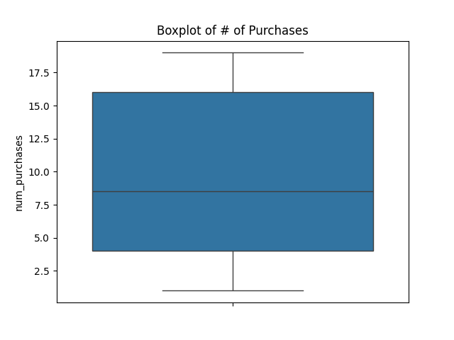

**Descripción**: Este gráfico muestra la variabilidad en el número de compras realizadas por los usuarios, incluyendo los valores atípicos.

### 7. Heatmap de Correlación

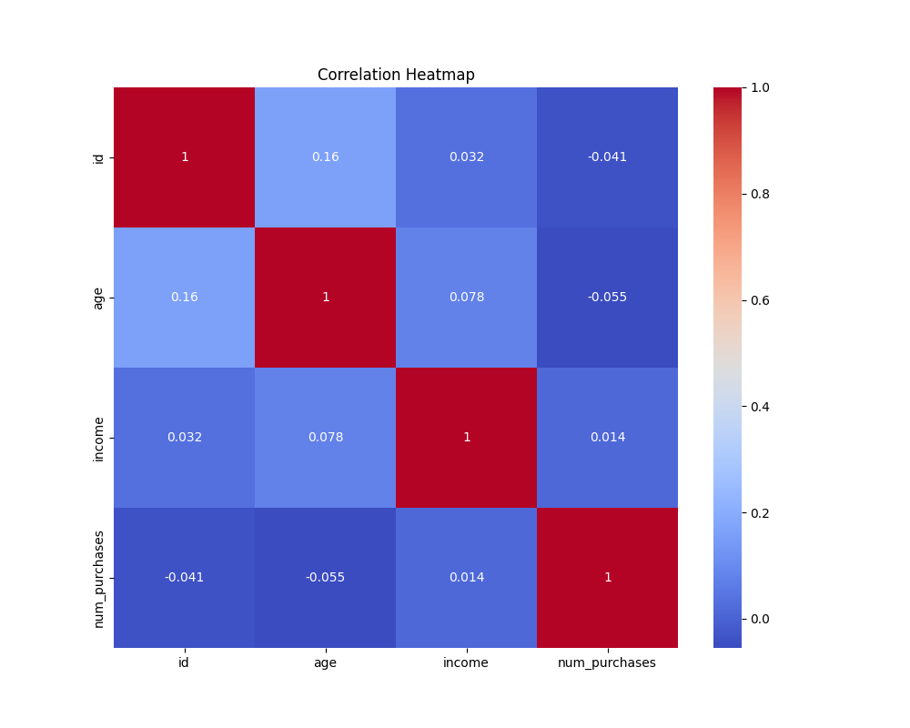

**Descripción**: El heatmap muestra las correlaciones entre diferentes variables numéricas en el dataset. Se pueden identificar relaciones significativas entre algunas variables.

### 8. Heatmap de Valores Perdidos

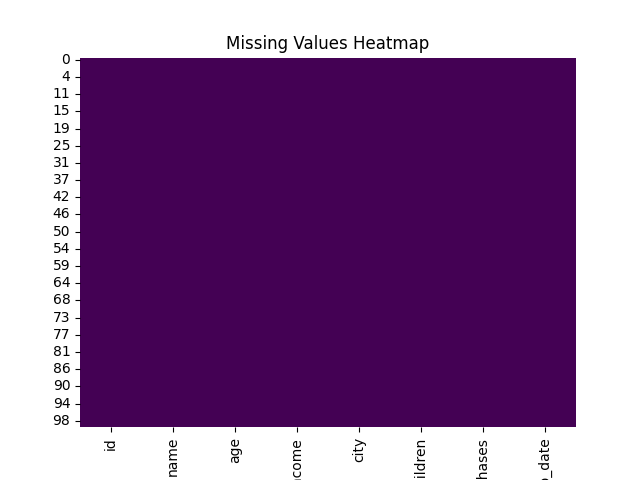

**Descripción**: Este heatmap muestra la distribución de valores faltantes en el dataset. Ayuda a identificar patrones en los datos ausentes.

### 9. Clientes por ciudad

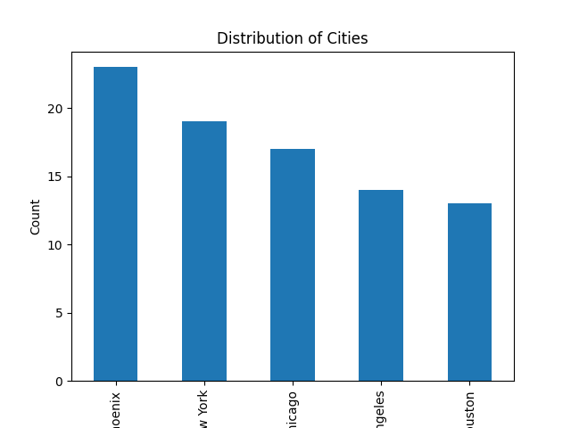

**Descripción**: El gráfico muestra la cantidad de clientes por ciudad. Se observa que la ciudad de Phoenix tiene el mayor número de clientes.

### 10. Proporción de clientes con y sin hijos

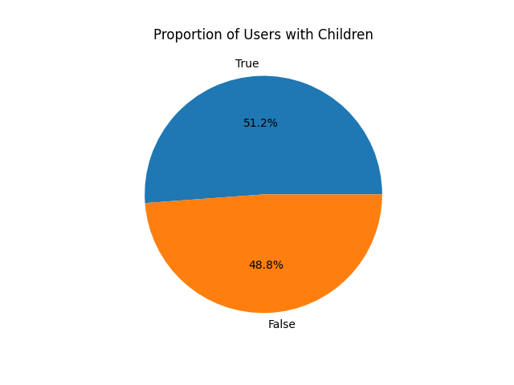

**Descripción**: Este gráfico ilustra la proporción de clientes con o sin hijos. Los clientes con hijos compran más.

### 11. Compras a lo Largo del Tiempo

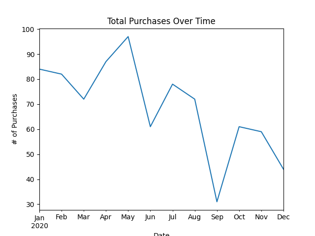

**Descripción**: El gráfico muestra cómo varía el número de compras realizadas a lo largo del tiempo. Se pueden observar tendencias y patrones estacionales.

### 12. Inscripciones por Mes

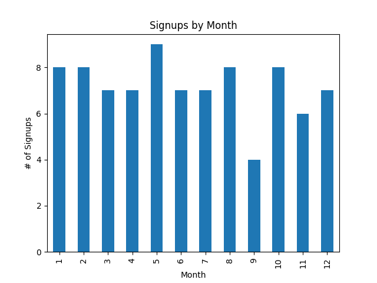

**Descripción**: Este gráfico muestra el número de inscripciones por mes. Se observa una tendencia estacional en las inscripciones a lo largo del año.

### 13. Relación entre Edad e Ingreso

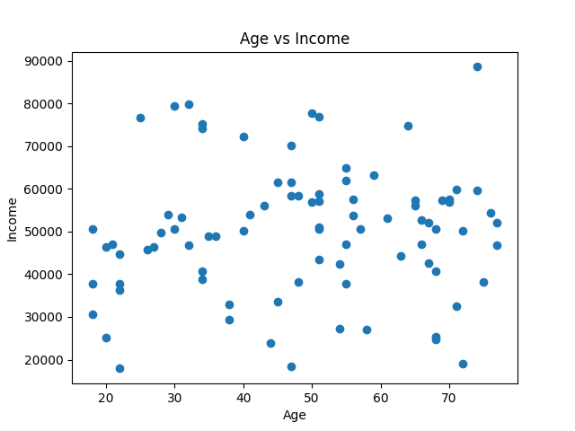

**Descripción**: El gráfico de dispersión muestra la relación entre la edad y los ingresos. Se puede observar si hay alguna correlación entre estas dos variables.

## Conclusiones

- La mayoría de los registros tienen edades entre 30 y 50 años.
- Los ingresos predominantes entre nuestros clientes se situan entre los 40.000 y 60.000, teniendo un mayor número de clientes cuyos ingresos se sitúan entre los 50.000 y 60.000.
- La mayoría de usuarios realizan un número bajo de compras, por debajo de 8.
- Tenemos un usuario de edad avanzada cuyos ingresos son atípicos respecto al resto de clientes.
- La ciudad de Phoenix concentra el mayor número de clientes de nuestra tienda.
- Los clientes con hijos compran un poco más que los que no tienen hijos.
- No parece existir una correlación entre la edad y los ingresos en nuestros clientes, observamos clientes en todos los rangos de edad con ingresos bajos, medios y altos.
- El número de compras ha decrecido desde mayo, mes con mayores compras, mientras que setiembre registro el peor dato de compras del año.
- El número de registros en nuestra tienda coincide en cantidad con el mes de mayor y de menor venta.
- Observamos que los clientes con mayor poder adquisitivo suelen tener hijos.
- La mayoría de las correlaciones del heatmap de correlaciones son muy bajas, lo que sugiere que en este conjunto de datos las variables no están fuertemente correlacionadas entre sí.
- No se observan valores anómalos o perdidos tras la limpieza del dataset.


